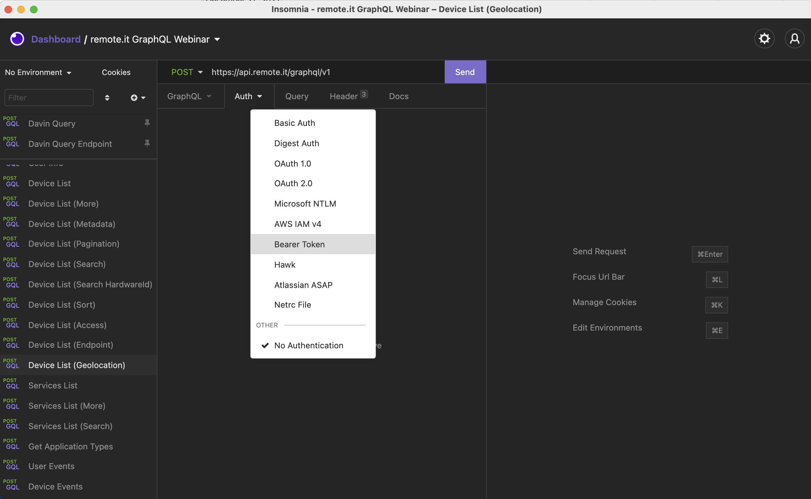
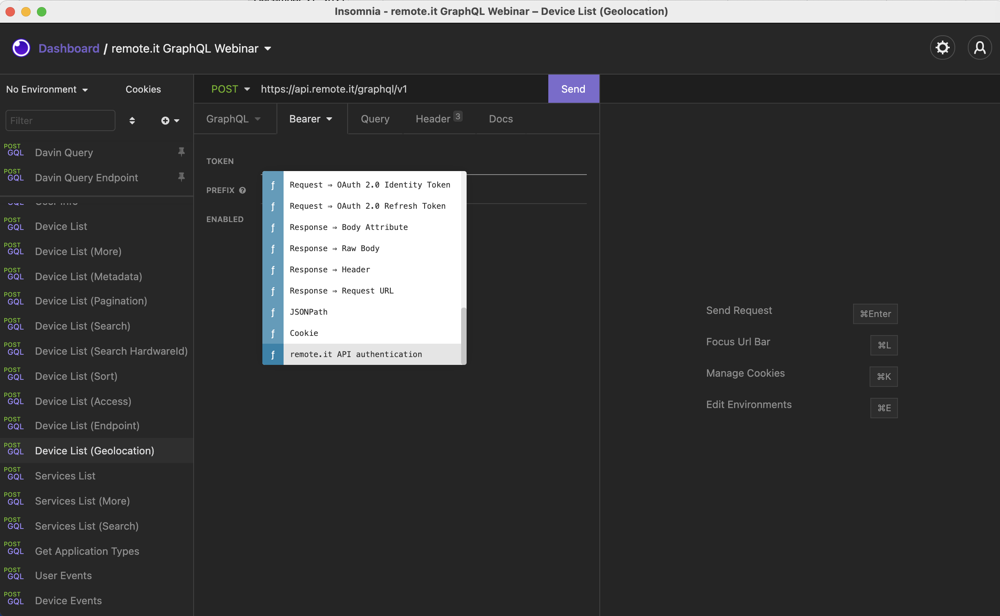

# Using Developer Tools

Insomnia is an API request IDE and a remote.it plugin is available to assist with authentication to allow you to experiment before you develop code.\
For graphQL, you can explore the schema, generate queries and mutations.\
For the REST-API, you can create http requests.

## Download and Install Insomnia



It is recommended that you install Insomnia Core rather than Insomnia Designer, but the plugin should work for both versions.

### Add the Plugin to Insomnia

We will be using a remote.it provided plugin to create queries which will automatically sign the requests.

Go to preferences:


Enter insomnia-plugin-remoteit and click _Install Plugin_

### Generate a graphQL Request

Make sure to create a _**POST**_ request and select _**GraphQL Query**_ as Body type. NOTE: All graphQL queries and mutations are made with **POST**

You can type a sample GraphQL query to [https://api.remote.it/graphql/v1](https://api.remote.it/graphql/v1) like:

```
{
  login {
    email
  }
}
```

If you haven't already set up your machine with the credentials file, see [here](authentication.md) and do so now.

Select the _**Auth**_ tab of the query and select _**Bearer Token**_ authentication.&#x20;



Click on the_**Token**_ field and `CTRL+Space`to select the _**remote.it API authentication**_ tag, and select a specific profile otherwise the default profile will be used.&#x20;



You now can send the request and execute the query using the credentials stored earlier.


If you want to start using the API requests in your code, you cannot use the generated code out of Insomnia as the generated signature is only good for that specific request. You will need to use the http request signing methodology. Some examples can be found on the [authentication page](authentication.md#examples).


## Download and Install Postman


These instructions have been written using Version 9.0.5


### Create a Remote.it Environment

You can quickly change postman environments for any request. All our required keys and headers will be stored here. Add and Save the values retrieved from your [credentials file](authentication.md#create-a-remote.it-credentials-file).&#x20;


```
R3_ACCESS_KEY_ID
R3_SECRET_ACCESS_KEY
R3_DEVELOPER_API_KEY
```

### Create and Setup Request

Make sure to create a _**POST**_ request and select _**Raw**_ or _**GraphQL**_ as the body type. NOTE: All graphQL queries and mutations are made with **POST**

#### **Body**


#### Pre-Request Script

Add the Pre-Request Script below to generate the needed environment variables for each request. This **MUST** be run prior to every request.&#x20;

```
//Sign with Remote.it Http-Signature
const urlTool = require('url')

function computeHttpSignature(config, headerHash) {
  let sig = 'Signature keyId="${keyId}",algorithm="${algorithm}",headers="${headers}",signature="${signature}"'

  // compute sig here
  let signingBase = ''
  config.headers.forEach(function(h){
    if (signingBase !== '') { signingBase += '\n' }
    signingBase += h.toLowerCase() + ": " + headerHash[h]
  })

  const hashf = (function() {
      switch (config.algorithm) {
        case 'hmac-sha1': return CryptoJS.HmacSHA1
        case 'hmac-sha256': return CryptoJS.HmacSHA256
        case 'hmac-sha512': return CryptoJS.HmacSHA512
        default : return null
      }
    }())

  const hash = hashf(signingBase, config.secretkey)
  const signatureOptions = {
        keyId : config.keyId,
        algorithm: config.algorithm,
        headers: config.headers,
        signature : CryptoJS.enc.Base64.stringify(hash)
      }

  // build sig string here
  Object.keys(signatureOptions).forEach(function(key) {
    var pattern = "${" + key + "}",
        value = (typeof signatureOptions[key] != 'string') ? signatureOptions[key].join(' ') : signatureOptions[key]
    sig = sig.replace(pattern, value)
  })
  return sig
}

//postman version 9.0.5 doesn't allow you get length of the body in all cases. Its dependent on the body 'mode' and computed at send request
function computeContentLength(mode, body){
    switch (mode) {
        case 'raw': { 
            if (body.raw == undefined) {
                return 0
            } else {
                return Buffer.byteLength(body.raw)
                
            }
        }
        case 'graphql': return Buffer.byteLength(getModifiedBody(body.graphql))
        default : return 0
    }  
}

function getModifiedBody(body) {
    let modifiedBody = {}
    Object.keys(body).forEach(function (h) {
        if (body[h] !== "" && body[h] !== 'undefined') modifiedBody[h]= body[h]
    })
    const modifiedBodyString = JSON.stringify(modifiedBody)
    return modifiedBodyString
}

function replaceVariables(content) {
    while(content.indexOf('{{') >= 0) {
        const variableName = content.substring(content.indexOf('{{')+2, content.indexOf('}}'))
        const variableValue= pm.environment.get(variableName) || pm.globals.get(variableName)
        content = content.replace('{{'+variableName+'}}', variableValue)
    }
    return content
}

const url = replaceVariables(request.url)
const { hostname } = urlTool.parse(url)
const accessKey = pm.environment.get('R3_ACCESS_KEY_ID') || pm.globals.get('R3_ACCESS_KEY_ID')
const accessKeySecretPreParse = pm.environment.get("R3_SECRET_ACCESS_KEY") || pm.globals.get("R3_SECRET_ACCESS_KEY")
const accessKeySecret = CryptoJS.enc.Base64.parse(accessKeySecretPreParse)
const curDate = new Date().toGMTString()
const targetUrl = url.trim().replace(new RegExp('^https?://[^/]+/'),'/') // strip hostname
const method = request.method.toLowerCase()
const contentLength = computeContentLength(pm.request.body.mode, pm.request.body)
const contentType = 'application/json'

const headerHash = {
      date : curDate,
      '(request-target)' : method + ' ' + targetUrl,
      'host' : hostname,
      'content-type': contentType,
      'content-length' : contentLength
    }
const config = {
      algorithm : 'hmac-sha256',
      keyId : accessKey,
      secretkey : accessKeySecret,
      headers : [ '(request-target)', 'host','date', 'content-type', 'content-length' ]
    }
const sig = computeHttpSignature(config, headerHash)

pm.request.headers.add({key: 'Authorization', value: sig})
pm.request.headers.add({key: 'Date', value: curDate})
pm.request.headers.add({key: 'content-length', value: contentLength})
pm.request.headers.add({key: 'content-type', value: contentType})
pm.request.headers.add({key: 'developerkey', value: '{{R3_DEVELOPER_API_KEY}}' })
```

### Send Request and review results


