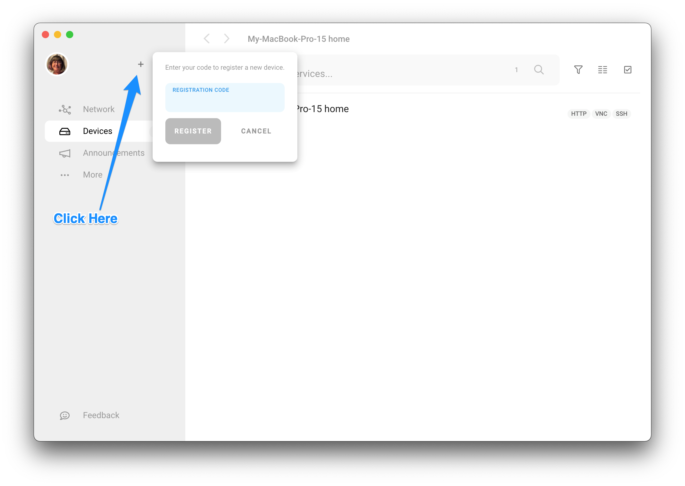
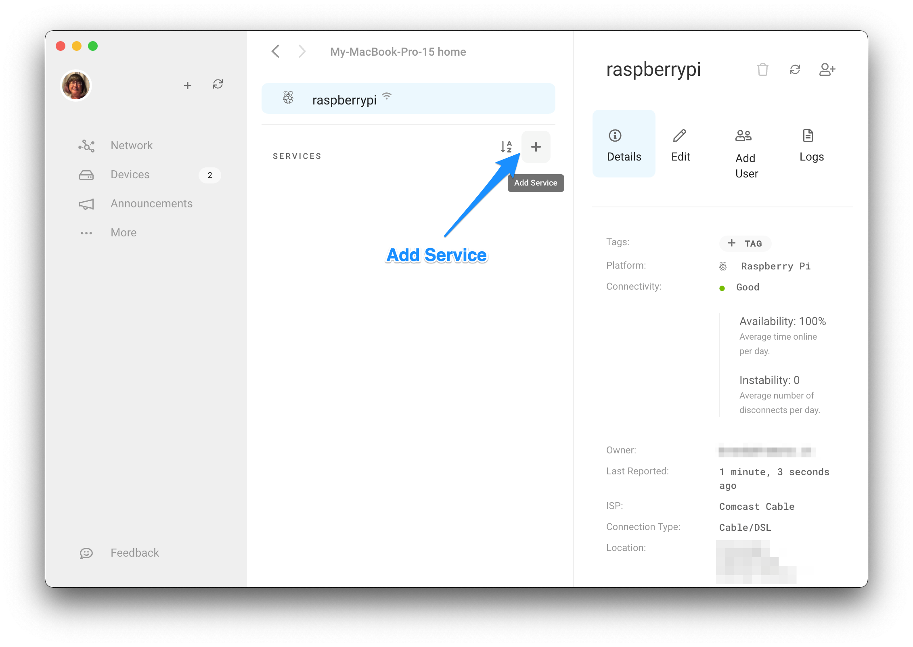
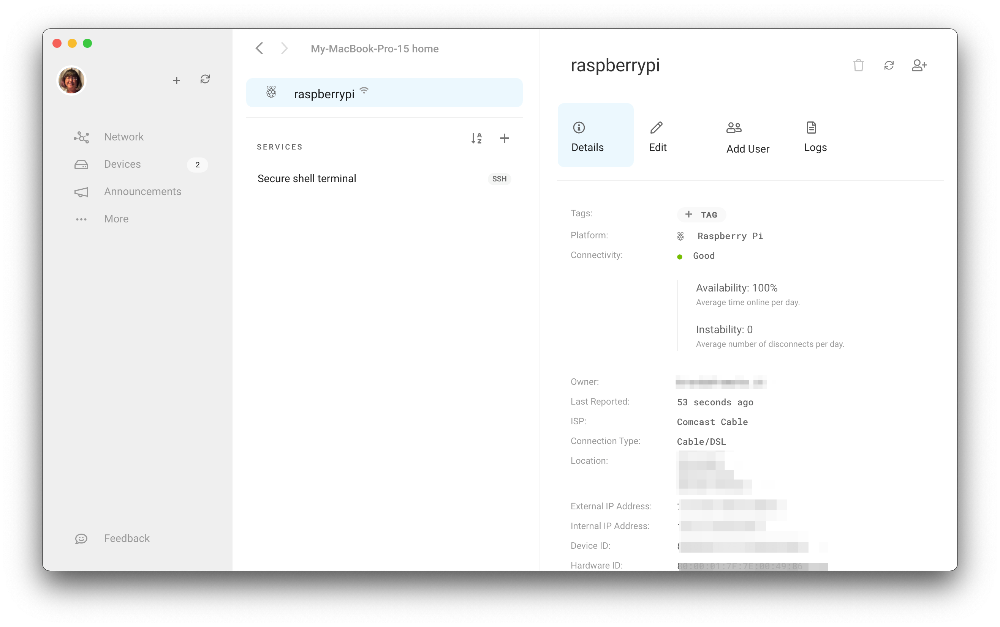

# Overview & Installation

This package installs the remoteit target agent which is the lowest level of component required for connections. **With this package installed, other devices can connect to this one, but this one cannot initiate connections to others.** If this device needs to be able to initiate a connection to another one, you will need to install the CLI \(if connections will be made via script or command line\) or the Desktop Application \(provides a straight forward UI to make connections and configure devices\).

You can interact with remoteit to run network diagnostics and troubleshoot other issues with your device. Use this package when you are concerned with the disk space and processes footprint.

## Supported Platforms


AWS Cloud users, please pick the distribution package that matches your OS and architecture installed on your instance below.


| Distribution | Architecture/package manager | URL for Package |
| :--- | :--- | :--- |
| Arch Linux | x86-64 \(pacman\) | [https://downloads.remote.it/remoteit/v4.13.5/remoteit-4.13.5-1-x86\_64.pkg.tar.zst](https://downloads.remote.it/remoteit/v4.13.5/remoteit-4.13.5-1-x86_64.pkg.tar.zst) |
| AWS Linux 2 | arm 64 | [https://downloads.remote.it/remoteit/v4.13.5/remoteit-4.13.5-1.aarch64.rpm](https://downloads.remote.it/remoteit/v4.13.5/remoteit-4.13.5-1.aarch64.rpm) |
| AWS Linux 2 | x86\_64 | [https://downloads.remote.it/remoteit/v4.13.5/remoteit-4.13.5-1.x86\_64.rpm](https://downloads.remote.it/remoteit/v4.13.5/remoteit-4.13.5-1.x86_64.rpm) |
| Debian | amd64 | [https://downloads.remote.it/remoteit/v4.13.5/remoteit-4.13.5.amd64.deb](https://downloads.remote.it/remoteit/v4.13.5/remoteit-4.13.5.amd64.deb) |
| Debian | arm64 | [https://downloads.remote.it/remoteit/v4.13.5/remoteit-4.13.5.arm64.deb](https://downloads.remote.it/remoteit/v4.13.5/remoteit-4.13.5.arm64.deb) |
| Debian | arm64 jetson nano | [https://downloads.remote.it/remoteit/v4.13.5/remoteit-4.13.5.arm64.jetson.deb](https://downloads.remote.it/remoteit/v4.13.5/remoteit-4.13.5.arm64.jetson.deb) |
| OpenWrt | opkg | [https://downloads.remote.it/remoteit/v4.13.5/remoteit\_4.13.5.ipk](https://downloads.remote.it/remoteit/v4.13.5/remoteit_4.13.5.ipk) |
| Raspberry Pi OS | armhf | [https://downloads.remote.it/remoteit/v4.13.5/remoteit-4.13.5.armhf.rpi.deb](https://downloads.remote.it/remoteit/v4.13.5/remoteit-4.13.5.armhf.rpi.deb) |
| Raspberry Pi OS | arm64 | [https://downloads.remote.it/remoteit/v4.13.5/remoteit-4.13.5.arm64.rpi.deb](https://downloads.remote.it/remoteit/v4.13.5/remoteit-4.13.5.arm64.rpi.deb) |
| RedHat Linux | arm64 | [https://downloads.remote.it/remoteit/v4.13.5/remoteit-4.13.5-1.aarch64.rpm](https://downloads.remote.it/remoteit/v4.13.5/remoteit-4.13.5-1.aarch64.rpm) |
| RedHat Linux | x86\_64 | [https://downloads.remote.it/remoteit/v4.13.5/remoteit-4.13.5-1.x86\_64.rpm](https://downloads.remote.it/remoteit/v4.13.5/remoteit-4.13.5-1.x86_64.rpm) |

## New Installation

This guide will step you through the set up of remote.it on **Debian, Ubuntu and Linux** devices using the command line/terminal and an installation package on a device which remoteit has not been previously installed.


Prerequisites: 

1. You have a remote.it account \(If not, please go ahead and create an account at [https://app.remote.it](https://app.remote.it)\)
2. You have installed the remote.it Desktop application on a machine you will be using to configure and connect to your device. \(This doesn't need to be on the same network as the device you are setting up\) See [https://remote.it/download/](https://remote.it/download/) for the different options available.


### 1. Download the package

Open a terminal window on the device where remote.it will be installed. Then download the package. Example below is for a specific pi package. Please use the appropriate package url. This will place the file in your home directory [See above](installation.md#supported-platforms) for specific packages and urls.


sudo command is only required on systems where you are not logged in as root. 


```text
sudo wget [URL for Package (i.e. 
https://downloads.remote.it/remoteit/v4.13.5/remoteit-4.13.5.arm64.deb
)]
```

### 2. Update your package manager and install



Continue in terminal on the target device

```text
sudo apt update
```

Once that completes, then continue with the installation replacing the path and file name as appropriate

```text
sudo apt install [file name (i.e. ./remoteit-4.13.5.armhf.rpi.deb
)]
```

**When this completes you will see the claim code to use in the desktop application to complete the setup.**



Continue in terminal on the target device

```text
opkg update
```

Once that completes, then continue with the installation replacing the path and file name as appropriate

```text
opkg install ./file
```

**When this completes you will see the claim code to use in the desktop application to complete the setup.**



Continue in terminal on the target device

```text
sudo yum update
```

Once that completes, then continue with the installation replacing the path and file name as appropriate

```text
sudo yum install ./file
```

**When this completes you will see the claim code to use in the desktop application to complete the setup.**



Continue in terminal on the target device

```text
sudo pacman -Syy
```

Once that completes, then continue with the installation replacing the path and file name as appropriate

```text
sudo pacman -U ./file
```

**When this completes you will see the claim code to use in the desktop application to complete the setup.**




You will need this claim code to complete the setup in the next steps. Save it until you complete registering the device. 

**This claim code is valid for 24 hours. If not used before then, re-run your installation command to get a new code.**



### 3. Claim and register the device

Open your remote.it desktop application and log in. Then add the device using the registration claim code by clicking the + \(Device Registration\) in the upper left.



You have now successfully registered the device to your account and should see it in your device list. If you get a message that it was not found, this indicates that the device was already claimed.

### 4. Set up services on your device

You will now define the services/ports for connections. For example SSH, HTTP, VNC, etc.


The device itself must be online to set up any services. The services you define in remote.it need to be set up and running on the device. For example if you set up VNC in remote.it, but do not have it running, it will not be reachable by remote.it


Click on the device to see its details and click the + in the Services panel to add a new service.  




Select the appropriate service type. Then provide a name, port, and service host address \(Defaults are provided for most services\). Only override default ports if you have assigned a different port for this service on your device.  

Click save. You will now see the new service. 



Repeat this process until you have all the services you want available via remote.it. You are now ready to connect and/or share this device. Visit [connections page](https://support.remote.it/hc/en-us/articles/360048935411-Connections) or the [sharing page](https://support.remote.it/hc/en-us/articles/360053354671-Device-Service-Sharing).

## Upgrades


If you have a device with Desktop or CLI installed, upgrade those applications directly. If you have a version of remoteit which is older than 3.0, please [contact support](https://support.remote.it/hc/en-us/requests/new) so that we can assist you directly.


To upgrade a device with remoteit device package Version 3.0 and higher installed follow these instructions.

### 1. Connect to ssh service on your device

Start an ssh connection \(either directly or through remoteit\) OR terminal and direct access to the target device

### 2. Download the package

Create an ssh connection to the device via remote.it and open terminal. \(If you do not have a remoteit ssh service defined, you can [create one](installation.md#4-set-up-services-on-your-device) or connect directly by using either the LAN or direct hardware console access\)

Download the installation package to the device where remote.it will be installed. Example below is for a specific pi package. Please use the appropriate package url. This will place the file in your home directory [See above](installation.md#supported-platforms).

```text
sudo wget https://downloads.remote.it/remoteit/v4.13.3/remoteit-4.13.3.armhf.rpi.deb
```

### 3. Install the new package

This will step will update the remoteit target daemon and preserve the previously defined services and configurations. age manager as appropriate. i.e. Opkg, RPM or another package manager



Continue in terminal on the target device

```text
sudo apt update
```


If using remoteit to access ssh to the device, you will lose your ssh connection to the device during this step. This is normal since we are replacing the daemon and remoteit will restart the service. 


During this step your desktop app will notify you that the device has gone offline. This is normal as the remoteit target service will stop during upgrade.   
Once this step completes you will again be notified that the device has come back online. If you were using the desktop for your connection, this connection will resume.

```text
sudo nohup apt install ./file &
```



Continue in terminal on the target device

```text
opkg update
```


If using remoteit to access ssh to the device, you will lose your ssh connection to the device during this step. This is normal since we are replacing the daemon and remoteit will restart the service. 


You may also need to install nohup which is not installed by default on most systems. This allows the installation to continue once the upgrade is in process and ssh hangs up temporarily.

```text
opkg install coreutils-nohup
```

During this  next step your desktop app will notify you that the device has gone offline. This is normal as the remoteit target service will stop during upgrade.   
Once this step completes you will again be notified that the device has come back online. If you were using the desktop for your connection, this connection will resume.

```text
nohup opkg install ./file &
```



Continue in terminal on the target device

```text
yum update
```


If using remoteit to access ssh to the device, you will lose your ssh connection to the device during this step. This is normal since we are replacing the daemon and remoteit will restart the service. 


You may also need to install nohup which is not installed by default on most systems. This allows the installation to continue once the upgrade is in process and ssh hangs up temporarily.

```text
yum install coreutils
```

During this  next step your desktop app will notify you that the device has gone offline. This is normal as the remoteit target service will stop during upgrade.   
Once this step completes you will again be notified that the device has come back online. If you were using the desktop for your connection, this connection will resume.

```text
nohup yum install ./file &
```



## Uninstall

These instructions apply to the remoteit Device Package Version 4 and higher.  
For earlier versions please refer to our [support guide](https://link.remote.it/support/remove-connectd).


**You cannot remove remote.it software while using a remote.it connection.** For this procedure, you will need to use either LAN or hardware console access to your device.


```text
sudo apt remove remoteit
```

At this point, you can then go to your device list \(either in the Desktop Application or in the web portal at [https://app.remote.it/\#devices](https://app.remote.it/#devices) and delete the device to remove it from your device registry.

