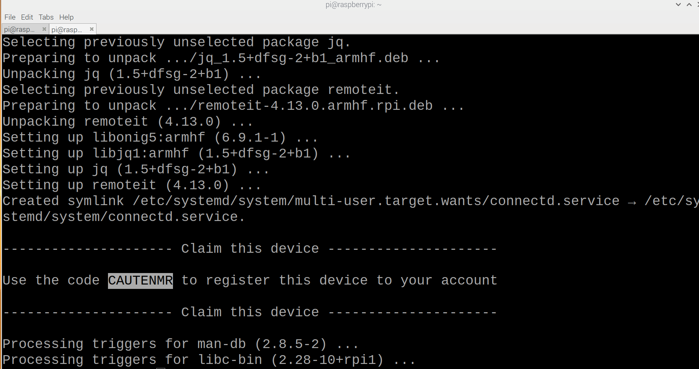
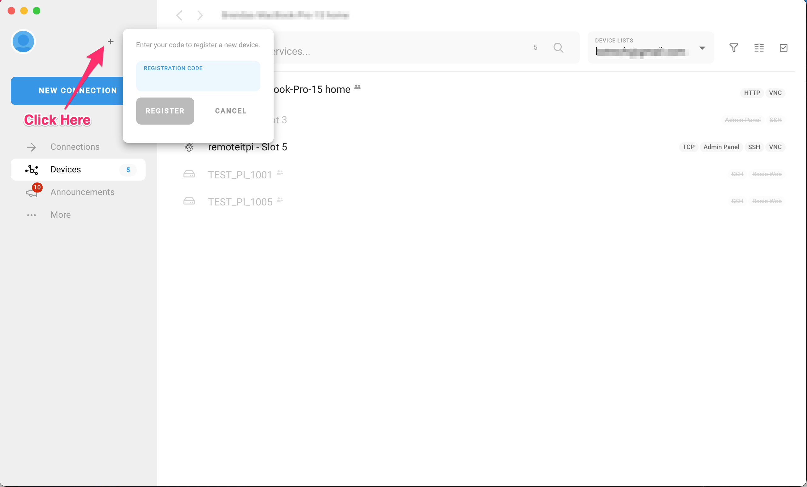
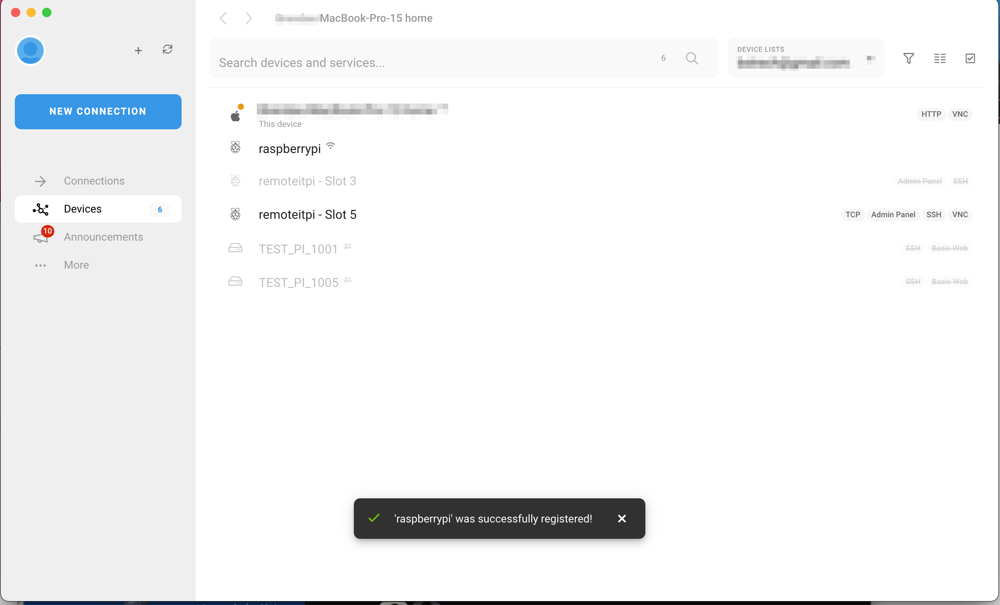
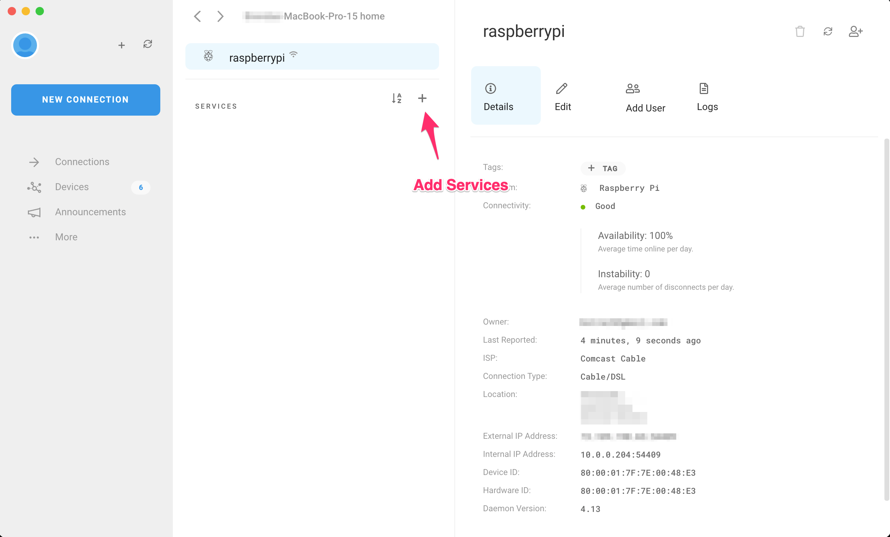
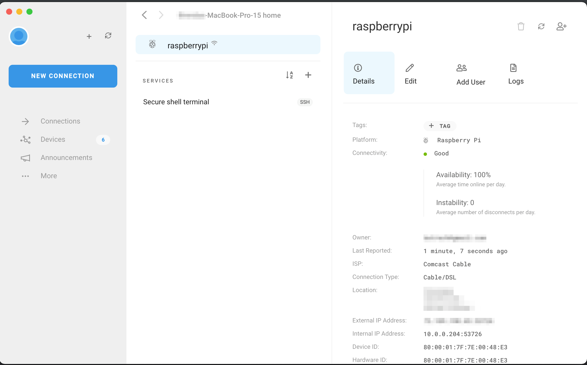

# Linux

This guide will step you through the set up of remote.it on **Debian, Ubuntu and Linux** devices using the command line/terminal and an installation package


Prerequisites: 

1. You have a remote.it account \(If not, please go ahead and create an account at [https://app.remote.it](https://app.remote.it)
2. You have installed the remote.it Desktop application on a machine you will be using to configure and connect to your device. \(This doesn't need to be on the same network as the device you are setting up\) See [https://remote.it/download/](https://remote.it/download/) for the different options available.



## 1. Download the package

Download the installation package to the device where remote.it will be installed \(download locations coming soon\)

## 2. Update apt and install

Open terminal on the target device

```text
sudo apt update
```

Once that completes, then continue with the installation replacing the path and file name as appropriate

```text
sudo apt install ./file
```

When this completes you will see the claim code to use in the desktop application to complete the setup.


You will need this claim code to complete the setup in the next steps




## 4. Claim and register the device

Open your remote.it desktop application and log in. Then add the device using the registration claim code by clicking the + \(Device Registration\) in the upper left.



You have now successfully registered the device to your account and should see it in your device list. If you get a message that it was not found, this indicates that the device was already claimed.



## 5. Set up services on your device

You will now define the services/ports for connections. For example SSH, HTTP, VNC, etc.


The services you define in remote.it need to be set up and running on the device. For example if you set up VNC in remote.it, but do not have it running, it will not be reachable by remote.it


Click on the device to see its details and click the + in the Services panel to add a new service.  




Select the appropriate service type. Then provide a name, port, and service host address \(Defaults are provided for most services\). Only override default ports if you have assigned a different port for this service on your device.  

Click save. You will now see the new service. 



Repeat this process until you have all the services you want available via remote.it. You are now ready to connect and/or share this device.

